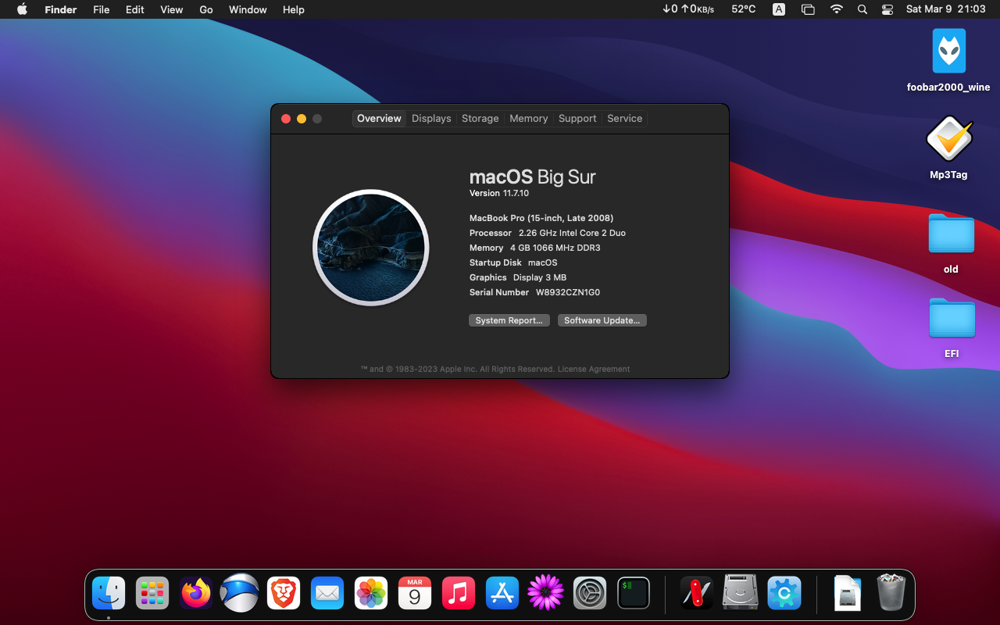

<h1 align="center">macOS Big Sur on ThinkPad x200</h1>

#### I am not responsible for any damages you may cause.

> ### Non-Fuctional

| Feature                              | Status | Dependency          |
| :----------------------------------- | ------ | ------------------- |
| Fingerprint Reader                   | ❌   | `DISABLED` in BIOS to save power. |
| Wireless WAN                         | ❌   | `DISABLED` in BIOS to save power. |
| VGA Port                             | ❌   | Does not exist on real apple computers. |

> ### Video and Audio

| Feature                              | Status | Dependency          |
| :----------------------------------- | ------ | ------------------- |
| Graphics Accleration                 | ❌   | `WhateverGreen.kext`  |
| Audio Recording                      | ✅   | `AppleALC.kext`       |
| Audio Playback                       | ✅   | `AppleALC.kext`       |
| Automatic Headphone Output Switching | ✅   | `AppleALC.kext`       |
| Dock Audio Port                      | ✅   | `AppleALC.kext`       |

> ### Power, Charge, Sleep and Hibernation

| Feature                              | Status | Dependency          |
| :----------------------------------- | ------ | ------------------- |
| Battery Percentage Indication        | ✅   | `ECEnabler.kext`            | 
| Power Management                     | ✅   | `XCPM`, enabled by `SSDT-PM.aml` |
| S3 Sleep/ Hibernation Mode 3         | ❌   |   |   
| Battery Life                         | ✅   | Native, comparable to Windows/Linux. |

> ### Input/ Output

| Feature                              | Status | Dependency          |
| :----------------------------------- | ------ | ------------------- |
| WiFi                                 | ✅   | `AirportItlwm.kext`  |
| Bluetooth (external)                 | ✅   | `BrcmPatchRAM.kext`  |
| Ethernet                             | ✅   | `IntelMausi.kext`  |
| USB 2.0                              | ✅   | `USBMap.kext`   |
| USB Power Properties                 | ✅   | `SSDT-EC.aml` |

> ### Display, TrackPad, TrackPoint, and Keyboard

| Feature                              | Status | Dependency          |
| :----------------------------------- | ------ | ------------------- |
| Brightness Adjustments | ❌  | `WhateverGreen.kext` and `BrightnessKeys.kext`|
| TrackPoint             | ✅  | `VoodooPS2Controller.kext` |
| TrackPad               | ✅  | `VoodooPS2Controller.kext` |
| Built-in Keyboard      | ✅  | `VoodooPS2Controller.kext` ||

> ### macOS Continuity

| Feature                              | Status | Dependency          |
| :----------------------------------- | ------ | ------------------- |
| iCloud, iMessage, FaceTime           | ❗   | Not tested            |
| AirDrop                              | ❗   | Not tested            |
| Time Machine                         | ❗   | Native: Not tested    |

<strong> REFERENCES </strong>

 

Read these before you start:

- [dortania's Hackintosh guides](https://github.com/dortania).
- [dortania's OpenCore Install Guide](https://dortania.github.io/OpenCore-Install-Guide/).
- [dortania's OpenCore Post Install Guide](https://dortania.github.io/OpenCore-Post-Install/).
- [dortania/ Getting Started with ACPI](https://dortania.github.io/Getting-Started-With-ACPI/).
- [dortania/ opencore `multiboot`](https://github.com/dortania/OpenCore-Multiboot).
- [dortania/ `USB map` guide](https://dortania.github.io/OpenCore-Post-Install/usb/).
- [WhateverGreen Intel HD Manual](https://github.com/acidanthera/WhateverGreen/blob/master/Manual/FAQ.IntelHD.en.md).
- [Installing macOS Ventura or newer on legacy Intel CPUs](https://github.com/5T33Z0/OC-Little-Translated/blob/main/14_OCLP_Wintel/Guides/Nehalem-Westmere-Lynnfield.md)
- [Sandy and Ivy Bridge Power Management](https://dortania.github.io/OpenCore-Post-Install/universal/pm.html#sandy-and-ivy-bridge-power-management)
- [How to Enable CPU Power Management on macOS](https://elitemacx86.com/threads/how-to-enable-cpu-power-management-on-macos-intel-amd.93/)
- `Configuration.pdf` and `Differences.pdf` in each `OpenCore` releases.

<det)ails>

<strong> REQUIREMENTS </strong>

 

- A macOS machine(optional): to create the macOS installer.
- Flash drive, 12GB or more, for the above purpose.  
- Xcode works fine for editing plist files on macOS, but I prefer [PlistEdit Pro](https://www.fatcatsoftware.com/plisteditpro/).  
- [ProperTree](https://github.com/corpnewt/ProperTree) if you need to edit plist files on Windows.  
- [MaciASL](https://github.com/acidanthera/MaciASL), for patching ACPI tables and editing ACPI patches.
- [MountEFI](https://github.com/corpnewt/MountEFI) to quickly mount EFI partitions.  
- [IORegistryExplorer](https://developer.apple.com/downloads), for diagnosis.  
- [Hackintool](https://www.insanelymac.com/forum/topic/335018-hackintool-v286/), for diagnostic ONLY, Hackintool should not be used for patching, it is outdated.
- Patience and time, especially if this is your first time Hackintosh-ing.

<strong> HARDWARE </strong>

 

| Category    | THINKPAD X220            |
| ----------- | ------------------------ |
| CPU         | Intel Core 2 Duo P8400   |
| RAM         | 4 GB DDR3 SDRAM(PC3-8500) |
| GPU         | Intel GMA 4500MHD         |
| HDD         | 500GB                    |
| Display     | 12.1' WXGA (1280x800)    |
| WiFi / BT   | Centrino® N 2200/BCM 2045B |
|Bootloader   | OpenCore v0.7.1      |

- Refer to [X200-Platform_Specifications](https://www.productindetail.com/pn/lenovo-thinkpad-x200) for possible stock ThinkPad X200 configurations.

<strong> BIOS </strong>

   
  
| Category       |                                     |
| -------------- | ----------------------------------- |
| Serial ATA     | AHCI                                |

<strong> GETTING STARTED </strong>

 

Before you do anything, please familiarize yourself with basic Hackintosh terminologies and the basic Hackintosh process by throughly reading Dortania guides as linked in `REFERENCES`

- Creating a macOS installer(MBR boot): refer to [Dortania's OpenCore Install Guide](https://dortania.github.io/OpenCore-Install-Guide/installer-guide/)
- [**README-HARDWARE**](/Other/README_HARDWARE.md): Requirements before installing.
- [**README-OTHERS**](/Other/README_OTHERS.md): for post installation settings and other remarks.

<strong> POST-INSTALLATION </strong>

 

- To use mod bios, disable the AppleCpuPmCfgLock Quirk.
- To use HomeBrew, edit HomeBrew ENV from '-march=nehalem' to '-march=core2'  

 

# Credits
- [Apple](https://www.apple.com) for macOS.
- [Acidanthera](https://github.com/acidanthera) for all the kexts/utilities that they made.
-  Theme for Opencanopy:  https://github.com/82ghost82/BigSurFlat
